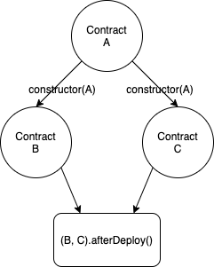

# Module Builder

Module builder is class interface for collection definition of [solidity contract bindings](./contract_binding.md) and [event hooks](./events.md). It is used in order to define contract constructor arguments and run events in order to set up desired smart contract infrastructure.

### Simple Module builder example image



### Deployment script to achieve this with `module()`

```typescript
export const RootModule = module('RootModule', async (m: ModuleBuilder) => {
  const A = m.contract('A');
  const B = m.contract('B', A);
  const C = m.contract('C', A);

  m.group(B, C).afterDeploy(m, 'afterDeployBandC', async () => {
    await A.instance().setExample(1);
  });
});
```

