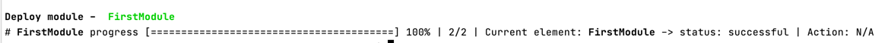
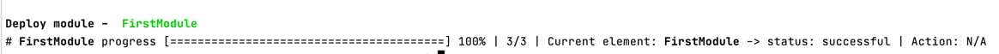

# Basic Tutorial

This will help you to understand a basic workflow and process of setting up simple deployment and what you can expect.


## Project setup 

You will need to have hardhat and ignition installed in some project.
```
yarn add hardhat --dev
yarn add @tenderly/ignition --dev
```

Init hardhat and run hardhat node as a test environment.

```
npx hardhat
```

```
npx hardhat node
```

Also make sure you have `ts-node` and `typescript` installed.

```
npm i ts-node
npm i typescript
```

## Workflow

Let's say that we have this simple contract inside our project.

`A.sol`

```solidity
pragma solidity ^0.7.0;

contract A {
  uint256 example;

  constructor() {
  }

  function hello() public pure returns (string memory) {
    return "hello";
  }

  function setExample(uint256 _example) public returns (bool) {
    example = _example;
    return true;
  }
}
```

### Ignition initialization

Firstly we will need to run next command in root of your project

```
ignition init --privateKeys=<private_key>
```
You can put hardhat generated `<private_key>` for testing.

This command will generate `ignition-config.json` and `ignition.config.ts` files.

`ignition-config.json` should look something like this.

```json
{
  "privateKeys": [
    "<private_key>"
  ]
}
```

`ignition.config.ts` should look something like this.

```typescript
import { IgnitionConfig } from '@tenderly/ignition';

export const config: IgnitionConfig = {}
```

### Deployment module

Next thing is to set up your own deployment module. Let's create file under `./deployment/first.module.ts`.

```typescript
import { buildModule, ModuleBuilder } from '@tenderly/ignition';

export const FirstModule = buildModule('FirstModule', async (m: ModuleBuilder) => {
  const A = m.contract('A');
});
```

So here, we initialized our `FirstModule`. So we are using `buildModule()` from ignition interface, and we named
it `FirstModule` alongside the function that has `m: ModuleBuilder`. `ModuleBuilder` is how you can specify what you
want to deploy/execute.

### Contract binding definition

```typescript
const A = m.contract('A');
```

This function is "binding" our solidity contract named `A` to our `ModuleBuilder` object, and it will return instance of
ContractBinding.

### Event definition

Let's add `afterDeploy` event (you can check [here](../concepts/module_builder/events.md) about more events) to our
newly initialized `ContractBinding`.

```typescript
A.afterDeploy(m, 'afterDeployA', async () => {
})
```

### Contract function execution

Let's try now to execute some contract function.

```typescript
A.afterDeploy(m, 'afterDeployA', async () => {
  const txReceipt = await A.instance().setExample();
})
```

You can see, that we need to run `instance()` first in order to be able to call `setExample()`. When ethereum
transaction gets confirmed you will get `TransactionReceipt` object as return.

You should end up with something like this:

```typescript
import { buildModule, ModuleBuilder } from '@tenderly/ignition';

export const FirstModule = buildModule('FirstModule', async (m: ModuleBuilder) => {
  const A = m.contract('A');

  A.afterDeploy(m, 'afterDeployA', async () => {
    await A.instance().setExample(11);
  });
});
```

### Module difference

Let's see what will be deployed if we stop here.

Run next command:

```
ignition diff ./deployment/first.module.ts --networkId=31337
```

This should be output in the console.

```
Module: FirstModule
+ Contract A
+ Event afterDeployBandC
```

### Module deployment #1

Now that we have defined a simple deployment module, lets run deploy command.

First check if you have your local node running.

```
npx hardhat node
```

Run `ignition deploy` command.

```
ignition deploy ./deployment/first.module.ts --networkId=31337
```

After command is successfully run, you should see in your logs something like this



Also, you should check `./.ignition/FirstModule/31337_deployed_module_state.json` file to confirm execution and check if
everything is correctly deployed.

### Additional contract binding

Let's create additional contract: `B.sol`

```solidity
//SPDX-License-Identifier: Unlicense
pragma solidity ^0.7.0;

import "./A.sol";

contract B {
  uint256 example;

  constructor(A a) {
  }
}
```

Add contract binding to `./deployment/first.module.ts` also.

```typescript
const B = m.contract('B', A);
```

Your `FirstModule` should look something like this.

```typescript
import { buildModule, ModuleBuilder } from '@tenderly/ignition';

export const FirstModule = buildModule('FirstModule', async (m: ModuleBuilder) => {
  const A = m.contract('A');
  const B = m.contract('B', A);

  A.afterDeploy(m, 'afterDeployA', async () => {
    await A.instance().setExample(11);
  });
});
```

### Module - State file difference

Now lets see what is the difference between the already deployed module and new one.

Run next command:

```
ignition diff ./deployment/first.module.ts --networkId=31337
```

Console output should be something like this.

```
Module: FirstModule
+ Contract B
  └── Contract: A
```

We don't see `ContractBinding(A)` and `afterDeployA` event because they are already deployed but `ContractBinding(B)` is
new, so we have `+` prefix.

### Change current binding

Let's change some part of the solidity code of `A.sol`, I'll just add more `oooo` to `hello` string in order to change bytecode.

Now run command:

```
ignition diff ./deployment/first.module.ts --networkId=31337
```

You should see this in your console logs:

```
Module: FirstModule
~ Contract:  A
~ Event afterDeployBandC
+ Contract B
  └── Contract: A
```

### Module deployment #2

We now want to execute our changes in `FirstModule` so let's run next command:

```
ignition deploy ./deployment/first.module.ts --network_id=31337
```

This should be execution logs:


### Module type hinting/generation

As a final step, lets generate typehints for your module for future development.

Run next command:

```
ignition genTypes ./deployment/first.module.ts
```

You can now see that additional file is generated under `./.ignition/FirstModule` - `FirstModule.d.ts`

It should have class that is similar to this one:

```typescript
export declare class FirstModuleBuilder extends ModuleBuilder {
  A: ContractBinding;
  B: ContractBinding;
  afterDeployBandC: StatefulEvent;
}
```

So you can now have type hint in your module if you change from `m: ModuleBuilder` to `m: FirstModuleBuilder`.

Your module function should look like this in order to have typehints:

```typescript
import { buildModule, ModuleBuilder } from '@tenderly/ignition';
import { FirstModuleBuilder } from '../.ignition/FirstModule/FirstModule';

export const FirstModule = buildModule('FirstModule', async (m: FirstModuleBuilder) => {
  const A = m.contract('A');
  const B = m.contract('B', A);

  A.afterDeploy(m, 'afterDeployBandC', async () => {
    await A.instance().setExample(11);
  });
});
```

