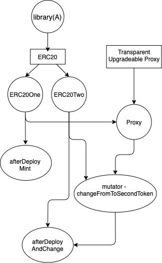

# Intermediate Tutorial

This would be a more complex showcase compared to the [basic](./basic.md) one. It'll tackle most of ignition's custom
functionality, and it'll explain what it is doing in the background.

Please go thought the [project setup](./basic.md#project-setup) first, and initialize all needed packages in an empty
project.

All contract files are [here](../../example/intermediate/contracts), please copy them into your project. We aren't going
to explain how all of those contracts are functioning but rather just their underlying dependencies.

## Init

So lets start first by running `ignition init` in empty project.

```
ignition init \
  --privateKeys=<private_key> \
  --mnemonic="test test test test test test test test test test test junk" \
  --hdPath="m/44'/60'/0'/0"
```

This would generate a ignition config file that looks something like this:

```json
{
  "privateKeys": [
    "<private_key>"
  ],
  "mnemonic": "test test test test test test test test test test test junk",
  "hdPath": "m/44'/60'/0'/0"
}
```

## Module overview



This image is a visual representation of the module
provided [here](../../example/intermediate/deployment/root.module.ts). We'll go thought step by step and explain every
part in details.

**Square** - Contract Prototype<br>
**Circle** - Smart-contract<br>
**Ellipse** - Event hook

Secondly, image above would be resolved in next order:

```
1. Deploy - library Address
2. Deploy - contract ERCOne
3. Execute - event afterDeployMintTokens
4. Deploy - contract ERC20Two
5. Deploy - Proxy
6. Execute - event mutator - changeFromToSecondToken
7. Execute - event afterDeployAndChange
```

## Library and prototypes

```typescript
m.library('Address');
m.prototype('TransparentUpgradeableProxy');
m.prototype('ERC20');
```

`m.library` - is an easy way to specify if contract is library and that it should be deployed first before any other
contract. Along the way ignition will automatically replace library contract address whenever library usage occurs.

`m.prototype` - is a contract abstraction for later use, most common use is if you need to deploy single contract
multiple times, we will see later how to do that.

## Prototype usage

```typescript
const ERC20 = m.bindPrototype('ERC20One', 'ERC20', 'ExampleToken', 'EXMPL');
const ERC20Two = m.bindPrototype('ERC20Two', 'ERC20', 'ExampleTokenTwo', 'EXMPLTWO');
const Proxy = m.bindPrototype('Proxy', 'TransparentUpgradeableProxy', ERC20, wallets[0].address, []);
```

In this part you can see usage of the prototype. First argument is `customContractName`, second one is `contractName`
and rest are constructor arguments of our contract.

## After deploy - mint ERC20One

```typescript
ERC20.afterDeploy(m, 'afterDeployMintTokens', async () => {
  const totalSupply = ethers.BigNumber.from(10).pow(18);
  await ERC20.instance().mint(wallets[0].address, totalSupply);

  await expectFuncRead(totalSupply.toString(), ERC20.instance().totalSupply);
});
```

In this `afterDeploy` event hook, we are minting new tokens to our first contract. After mint function we are confirming
that `totalSupply` for our contract is set with `expectFuncRead()`. In case if `totalSupply` is not set
correctly `expectFuncRead` function will throw error and whole deploy process would stop, if that occurs you can look
under `./ignition/<module_name>` for more information about deployment.

## Mutator

```typescript
const mutatorEvent = mutator(
  m,
  Proxy,
  'upgradeTo',
  [ERC20Two], {
    name: 'changeFromToSecondToken',
    slot: '0x360894a13ba1a3210667c828492db98dca3e2076cc3735a920a3ca505d382bbc' // bytes32(uint256(keccak256("eip1967.proxy.implementation")) - 1)
  }
);
```

Mutator is specially written macro like function. Her main use here is to change implementation from `ERC20One`
to `ERC20Two`. You can see that we are specifying `Proxy` as `ContractBinding` and `upgradeTo` function name that
would be called in order for upgrade to be executed. Next is array of `upgradeTo` function arguments and lastly custom `opts`
object that is housing custom name and slot. If `slot` is specified, instead of smartly determining getter function
(just removing `set` and putting `get`), it would call `eth_getStorageAt(contractAddress, slot)` and compare returned
data with contract address of `ERC20Two`.

To put it to simple words, it's upgrading proxy implementation and checking if upgrade actually happened.

## After deploy - mint ERC20Two

```typescript
m.group(ERC20Two, mutatorEvent).afterDeploy(m, 'afterDeployAndChange', async () => {
  const totalSupply = ethers.BigNumber.from(10).pow(17);
  await ERC20Two.instance().mint(wallets[1].address, totalSupply);

  await expectFuncRead(totalSupply.toString(), ERC20Two.instance().totalSupply);
});
```

And lastly we are going to mint `totalSupply` for `ERC20Two`. A first unique thing that we are using is `m.group`, this
enables you to specify when you want this event hook to be executed. Here you can see that we put both `ContractBinding`
and `StatefulEvent` -  `ERC20Two, mutatorEvent`. This would mean that this would execute after `ERC20Two` is deployed
but only if `mutatorEvent` is executed and if for some case event is not, execution would be postponed until it is.

